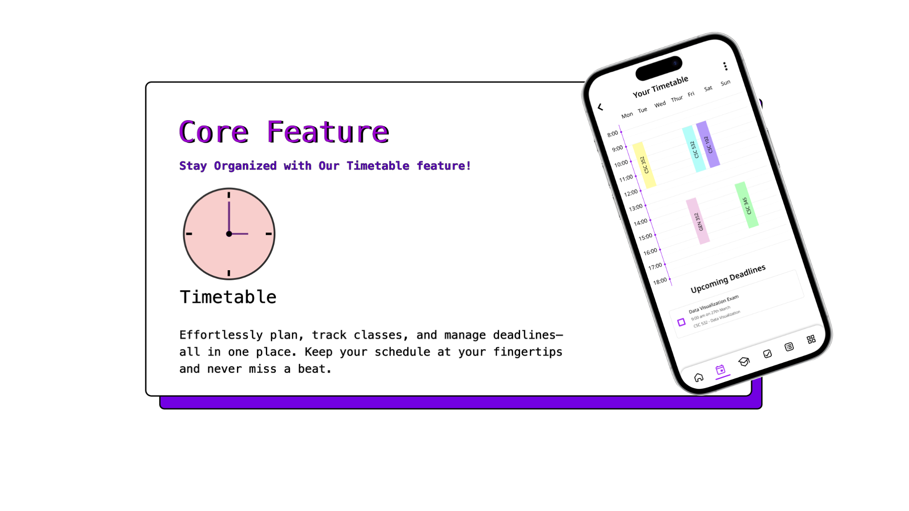
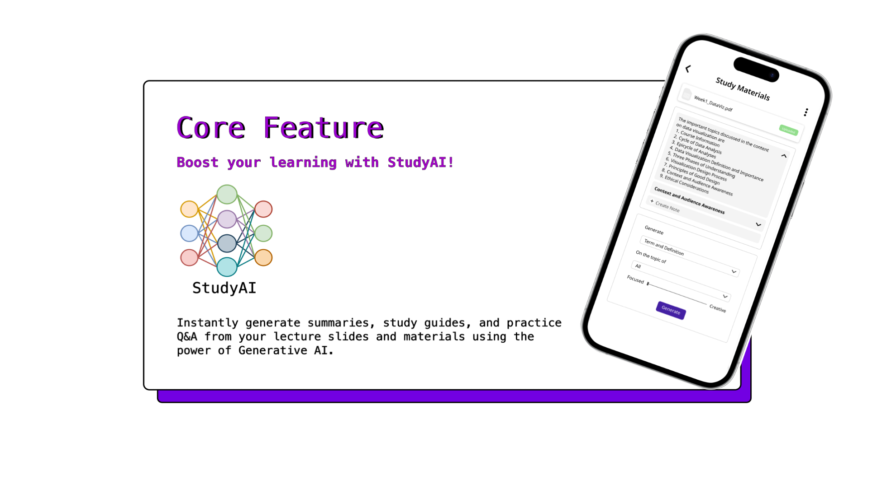
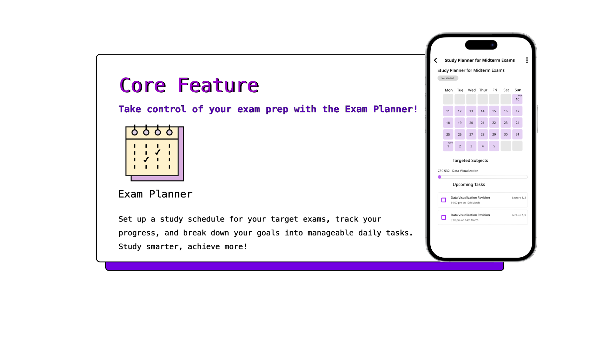

# 📚 EZRIA - Education Zone for Resourceful Integration and Assistance  
 

**Demo Repository**  
🚀 *Empowering students with AI-driven study management*  

---

## 🌟 About Ezria  
EZria is an intelligent **study organization and time management application** designed to help students efficiently manage study materials, schedules, and academic progress. It leverages **Generative AI** to **automatically generate study materials** from lecture slides and offers powerful tools to optimize study habits.

 

> ⚠️ **This repository is for demonstration purposes only. It does not include the full source code of the application.**

---

## 🎯 Key Features  
✅ **Time Management** – Plan study sessions with customizable calendars, reminders, and Google Calendar integration.  
 
✅ **AI-Powered Study Materials** – Automatically generate **summaries, flashcards, and study notes** from lecture slides.  
  
✅ **Study Tracker** – Log study hours, track task completion, and analyze study performance.  

---

## 🛠️ How to Explore the Demo  
Although the full application source code is not included in this repository, you can still explore EZria's features in the following ways:  

1. **Portofoli:** [Project Portfolio](https://seniorproject.sit.kmutt.ac.th/showproject/CS64-RE10)
2. **Watch the Demo Video:** 📽️ [Demo](https://www.youtube.com/watch?v=V-hTpv9-im0)
4. **View UI Screenshots:** 🖼️ *(Add images or a link to a gallery)*  
5. **Read Technical Documentation:** 📄 *(Provide any available docs, diagrams, or explanations about the app architecture)*  (to be updated)

---

## 🚀 Future Development  
EZria aims to continuously improve with features like:  
- Enhanced AI-driven **question generation** for exam preparation.  
- **Mobile-friendly** interface for on-the-go study tracking.  
- Advanced **collaborative tools** for study groups.  

---

## 🤝 Contributing  
Since this is a demo repository, contributions are not currently accepted. However, feel free to provide **feedback, suggestions, or ideas** for future enhancements!  

---

🌱 **Empowering students to study smarter with AI.**  
💡 *Stay organized. Learn efficiently. Achieve more with EZria!*  

---
